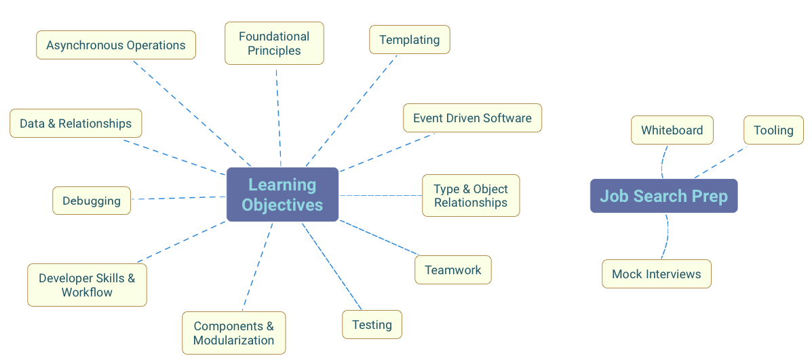

# Mastery Learning

Welcome to an experiment in education. Learning software development isn't like learning anything else, so we're not going to treat it like anything else. This is likely going to be a very different experience from your high school chemistry class or your college intro to philosophy.

## Difference of Mastery Learning

We're aiming for 100% of students to have 100% mastery of the material. This is an ambitous plan, and we're plannning on reaching it by allowing students to work at their own pace, providing students with lots of instructor guidance, and giving students access to all the resources they will need to succeed.

## Differences between traditional education and mastery learning

| Mastery Learning   | Traditional Education  |
| :----------------- |:-----------------------|
| Individualized progress and flexible class timing aimed at 100% of students achieving 100% comprehension of concepts      | Learning on a schedule with a syllabus, regardless of student understanding |
| Students work through material at their own pace      | All students work on the same material at the same time      |
| Instructor will make sure that all material has been  presented by the end of the class, but individual students are responsible for their own progress through the material | Teacher takes responsibility for keeping the class on schedule and for finishing the material by the end of the course      |

## Instructor Responsibilities

1. The instructor will present all of the critical material necessary to build a capstone by the end of the course.
1. The instructor will make sure all student questions are answered. Even the ones you consider to be "dumb", because "dumb" questions are often the most enlightening.

## Student Responsibilities

1. Owning your experience, which includes:
    * Show up to class
    * Participate in class discussions and group projects
    * Complete the exercises for each  milestone and top it all off with a capstone project
    * Timing is flexible, if  you need a little more time to completely understand a topic, take some time, ask for help and fill in any gaps in your understanding.
1. Ask questions! Even if the question is a "huh, I don't know where to start," it is absolutely imperative that students take responsibility for their own understanding and clarify any questions right away.
1. Make sure you are putting in the time and effort to reach success.

> **Bottom Line:** We will give you all of the ingredients, but it's up to you to bake the cake.

### Why

First, and most importantly, in software development, each concept builds upon the previous concept, so general understanding of each concept is necessary before moving on. Second, teaching adults over the course of a year is a unique situation, and the adults we accept into the program are expected to have the work ethic needed to forge their own path.

## NSS Learning Objectives
