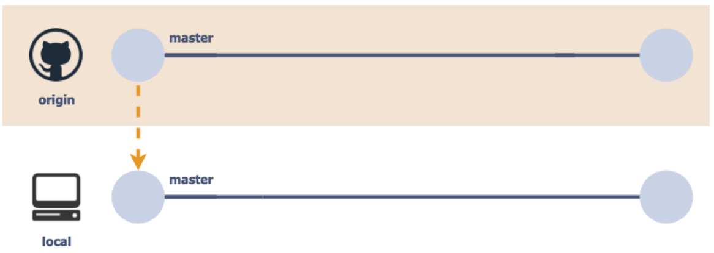
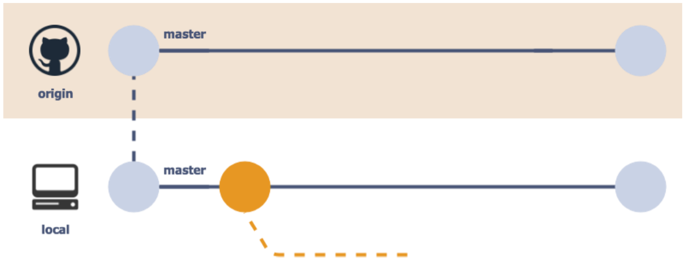
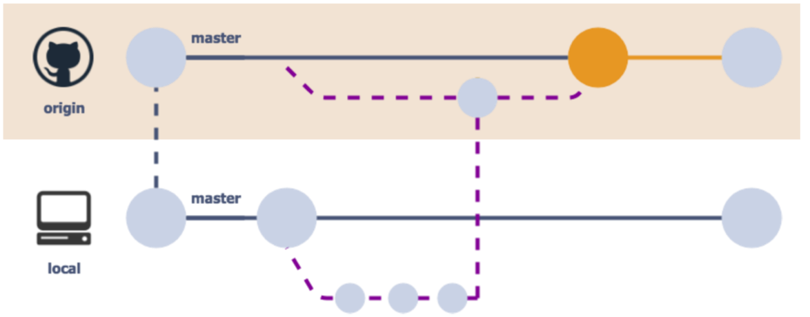
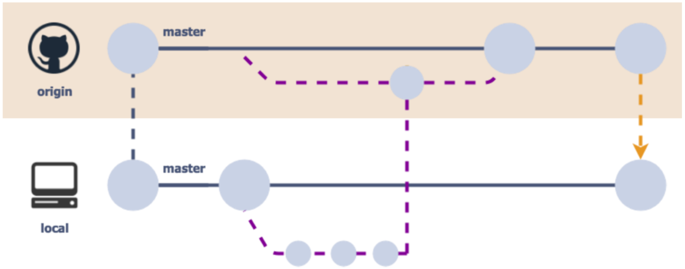

# Git Branching

## The Problem
Up to this point we have been following a simple git workflow:
* Make changes
* Add, commit, and push to master
* Start over

For the most part this works ok until we have more than one person using the same repo.  Let work through the following scenario.  Two teams are workign on the same product at a well known tech company.  Lets call this company Bookface.

Team 1 is run by Anne.  Their job is to implement a new feature where people can react to comments.  It should look something like:

Team 2 is run by Buster.  Busters team is building a feature where users can search for upcoming events.  It should look like this:

On top of creating these new feature the Bookface need to function without interruption.  Users should never know that something is changing until the features are completed - they shouldn't see partial new features.

Our current git workflow will not work for this.  If Anne and Buster are both making changes and commiting code to master then master will be polluted with code in various stages of done-ness.  The other option is for Anne and Buster to NEVER commit code until their feature is completely done - this is VERY risky and not a good option.

## The Solution
The simple solution to this problem is to use branches!  Basically each new feature gets its own branch.  Each branch is made off of the master branch at a certain point.  The history for the branch then diverges from master and the developers can do whatever they want/need to on the branch.  If things go horribly wrong they can delete the branch they made and none of the changes will make it to master.  When they are satisfied with the changes they have made to their branch and have sufficiently tested it out they can merge that code into master and the few feature will get delivered to the users in a completed form.

This new strategy looks something like this:

## Our Branching Process
__Step 1:__ Repo Creation
To start our process we will create a new repository in the exact same way we did before.
* We will make a local folder.
* Inside that folder we will make a README.md file.
* Inside the README.md file we will add a single line with the name of the project.
* We will create a repo on github
* We will connect the gihub repo to the local folder with `git remote add origin ...`
* We will add, commit, and push the changes to our README file to the master branch
* This will make our github master and our local master branch look the same

__Step 2:__ Create a branch

__Step 3:__ write a bunch of code

__Step 4:__ Push your branch to github

__Step 5:__ Open a PR

__Step 8:__ Review PR and merge it into master

__Step 10:__ Pull down master branch

