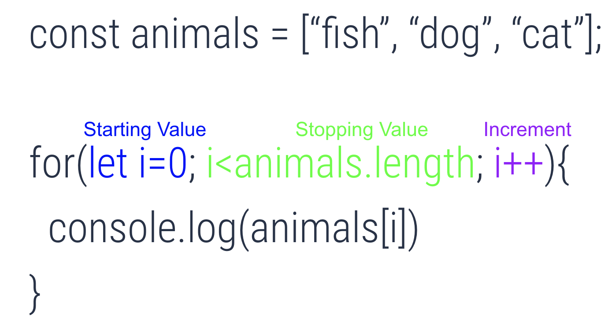

# Javascript Arrays and Looping
Arrays are like buckets of stuff where the order matters.  For example if we take a bucket and fill it with cats we should always know the order of the cats in the bucket;  something like:
```js
const cats = ['fluffy', 'spike', 'Mr. Whiskers', 'killer'];
```
The majority of the tasks you will accomplish in this course and in your dev career will involve looping over an array of objects and displaying that data to the DOM.

### For Loops
For loops allow you to do the same thing over and over again even when you don't know how many times you need to do something.  When you need to use a for loop you need to know the following:
1.  What value to start at
1. What value to stop at
1. How to increment
Once you know those three things you can translate what you know in the loop by putting the right thing in the right spot:



### Looping to the Dom
Now its time to put it all together.  The vast majority of front end web development involves taking an array of objects, looping over the array, and printing each object to the DOM.  Lets do that.  Say we have the following array of dinosaurs:
```js
const dinosaurs = [
  {
    dinoType: 't-rex',
    description: 'Many teeth.',
  },
  {
    dinoType: 'stegosaurus',
    description: 'Spiky back',
  },
  {
    dinoType: 'velociraptor',
    description: 'Will eat your face',
  }
];
```

In order to print these dinosaurs to the dom we will need to write two functions: `buildDinosaurs` and `printToDom`.

The `buildDinosaurs` function will be responsible for looping over the dinosaurs array and building up a domString that created a card for each dinosaur.  This function then passes that domString to the `printToDom` function.  The final code for both functions looks like this:
```js
const printToDom = (divId, textToPrint) => {
  const selectedDiv = document.getElementById(divId);
  selectedDiv.innerHTML = textToPrint;
};

const buildDinosaurs = () => {
  let domString = '';
  for(let i = 0; i < dinosaurs.length; i++){
    domString += `<div class="dinosaur">`
    domString +=   `<h3>${dinosaurs[i].dinoType}</h3>`;
    domString +=   `<p>${dinosaurs[i].name}</p>`
    domString += `</div>`
  }
  printToDom('dino-barn', domString)
};
```

Note: in order for the above code to work you will need to call the `buildDinosaurs` function at the bottom of your JS file.  You will also need to make a div in your index.html file that has an id of 'dino-barn'.