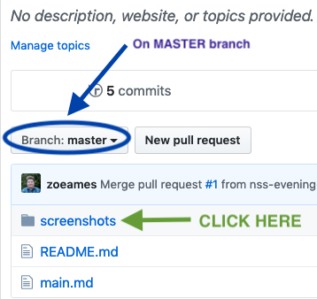
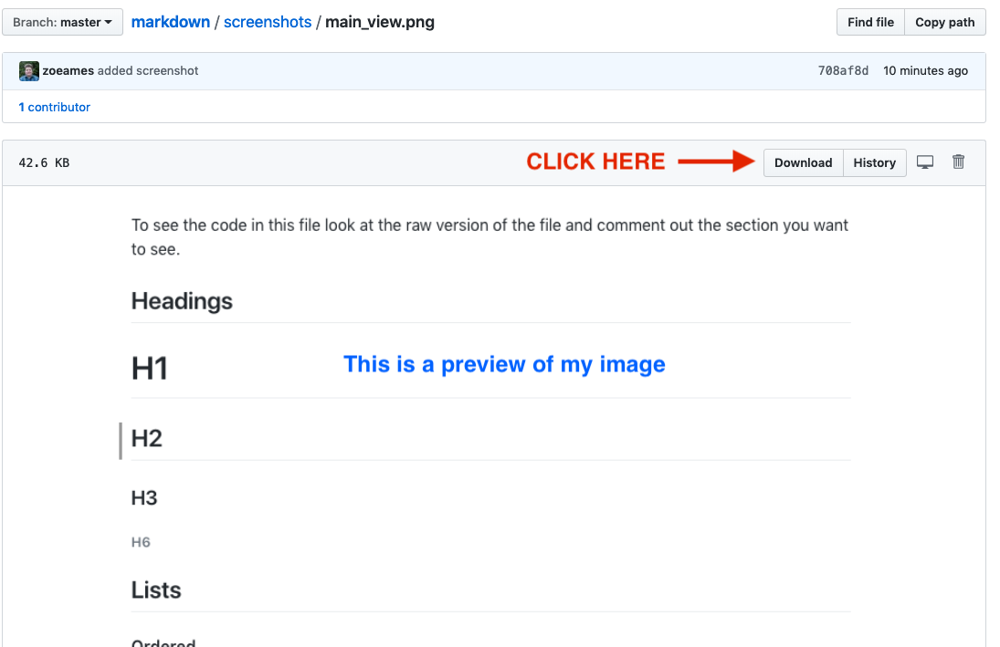

# Markdown

Markdown is a light-weight text formatting syntax.  It was created in 2004 by John Gruber and Aaron Swartz.  It was written to be extremely readable and to be easily converted to html.  Because of this you can wright straight HTML in a markdown file and it will look like you expect it to.  Markdown has different "flavors".  You will mostly be using the github flavor since we will be using markdown to write README.md files that display on github.

If you want to look at the markdown documentation written by its makers you can do so [HERE](https://daringfireball.net/projects/markdown/syntax)

## Syntax
DON'T memorize the markdown syntax.  Go look it up if you don't remember it.  here are some great cheat sheets:
* [Adam P Markdown Cheatsheet](https://github.com/adam-p/markdown-here/wiki/Markdown-Cheatsheet)
* [Markdown for Github](https://help.github.com/articles/basic-writing-and-formatting-syntax/)
* [Mastering Markdown](https://guides.github.com/features/mastering-markdown/)

## README.md
Every github project you have should have a well done README.md file.  This does a bunch of things for you:
* Shows employers you think creating documentation is important (they will want you to do this on the job)
* Shows employers you can articulate what you have done (soft skill)
* Shows people who find to your project how to use/run it
* Reminds you in 6+ months what the project is and how to use it


At minimum your readme file should have:
* Title (this is created on creation of the repo)
* Description
* Screenshot(s)
* Instructions for how to run the project


Look at a bad readme [HERE](https://github.com/zoeames/shapes)

Look at a good readme [HERE](https://github.com/morecallan/frontend-capstone)

## Adding Screenshots to README.md
1. Make a readme branch: `git checkout -b readme`
2.  Take a screenshot of your project (we called the screenshot main_view.png for this example)
  * [Mac Instructions (Mojave)](https://support.apple.com/en-us/HT201361)
  * [Windows Instructions (Windows 10)](https://www.howtogeek.com/226280/how-to-take-screenshots-in-windows-10/)
3.  In your project create a `screenshots` folder at the root
4.  Move the screenshot into the `screenshots` folder (`screenshots/main_view.png`)
5. Add, commit, push, create a PR and merge
6. Switch to the master branch and `git pull origin master`
7. Create another branch: `git checkout -b readme2`
8. Determine the URL for the screenshot - ON MASTER BRANCH
  *  On github click the screenshots folder (make sure you are on master branch)
  
  * Click on the file name that you want to include
  * You should now see a preview of your screenshot.  Click the download button.
    
  * Your image should now be opened in a new tab.  Copy the link in your navigation bar

9. Add the screenshot to your README.md (replace what is in parenthesis with the link you got in the step above)
```

```
10. Add, commit, push, make a PR, and merge it

Your readme on master branch should now be complete

