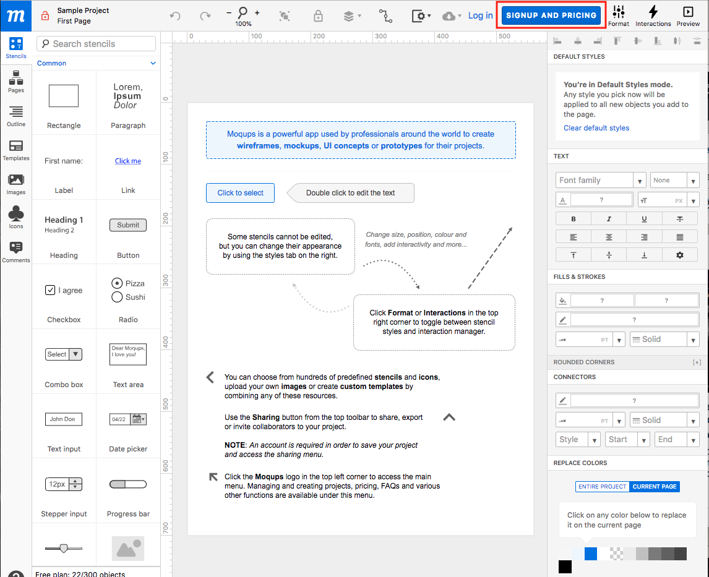
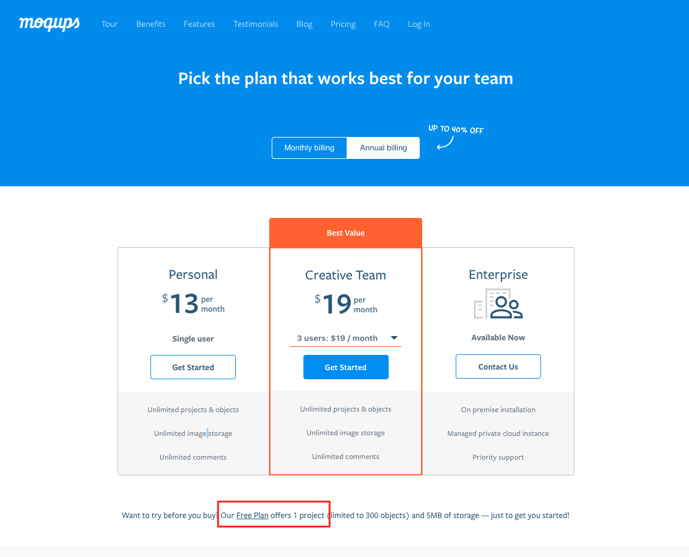

# Wireframes

Wireframes are visual guide that represents the skeletal framework of a website. Wireframes focus on the arrangement different elements (i.e. images, text, navigation) -- in thinking about the application's arrangement, it is common that functional and technical questions may arise. That's a good thing! So, you should always create wireframes in the planning phase of your project or (stretch) feature.

Wireframes should be something you can create/edit easily and should be accessible to you and your teammates (you should include them in your project cards).

> Wireframes in Group Projects: wireframes are useful in agreeing and implementing a uniform user interface (UI) throughout an application.

## Wireframe Tools
- Free, Web-based Option: [Moqups](https://moqups.com/)
- Photos of hand-drawn wireframes on whiteboards or paper
- Professional Programs, i.e. Photoshop
  - Only use these if you already have experience using the application

## Basics on taking screenshots
- Mac
  - `CMD + SHIFT + 4` lets you select an area and saves a screenshot to your desktop
  - `CMD + CTRL + SHIFT + 4` lets you select an area and saves a screenshot to your clipboard
- Windows
  - Windows 10: `windows + shift + s` lets you select an area and saves a screenshot of your active window to your clipboard
  - Use the Snipping Tool application on your computer

 > Remember to add your screenshots to your tickets!

## Moqups: Free Signup Steps

1. From [moqups](https://moqups.com/), click the 'try it now for free' button
1. From the editor window, click 'signup and pricing':

1. Scroll down and click the 'Free Plan' link:

1. Create an account

