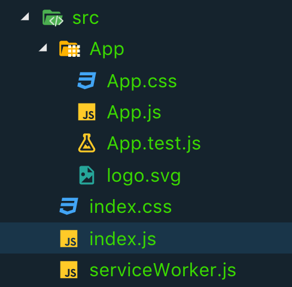
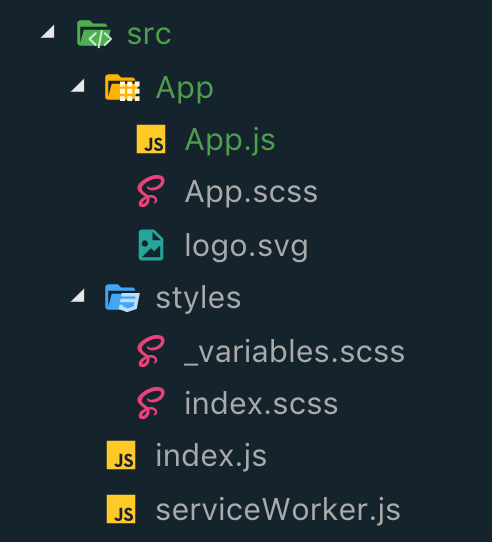

# Setting up React
To set up react we will be using a scaffolding tool called [Create React App](https://github.com/facebook/create-react-app).

## What is create-react-app?
create-react-app is a tool built by facebook that quickly sets up a React project.  The project was built with three main goals: one dependency (webpack does all the things), No configuration required (standard reasonable configurations for development and production builds), no lock-in (if you don't like the standard configuration you can eject and create your own).

Out of the box we will be able to enjoy the following great features:
* REACT with JSX
* ES6+ (all the es6 stuff we love writing with)
* Autoprefixes CSS (no need to add in all the -webkit stuff)
* Unit test runner (Jest is already installed and configured)
* Live development server (make some changes and the app automatically reloads)
* Build scripts to bundle all the things (JS, CSS, images, and sourcemaps)
* Ofline service works (you can *technically* do development offline)
* Hassle free updates (if a new version of create-react-app comes out you just update the version in the package.json file)

## Building a project
To kick things off we will use npx to build our app.  Npx is like Npm but it calls a script that a developer has built.  In this case the facebook developer have built out scripts that install all the required packages, setup webpack, and build out a basic application.
```js
npx create-react-app intro-react
```

If the above command didn't work for you, you need to update npm.  Find an instructor to help you with that.

## Organizing files (our changes)
### Create App Folder

Right now there are a bunch of files called app.SOMETHING that are just hanging out in the root of the src folder.  Thats kinda anoying so lets move those into a App folder. Also move the logo file into that folder.   Next check the index.js file and make sure the path is correct to the App module. Your file structure should now look like this:


### Remove testing

For the scope of this class we won't be using jest to do any testing - we just will not have time to.  To make sure our project looks clean lets go ahead and removing the App.test.js file.  You can also delete the test script in your package.json file.  If at some point you decide you want to try testing you can easily come back and add this stuff in.

### Make a global styles folder

We will need somewhere to hold our _variables.scss and other global styling files.
* Make a folder inside source called styles.
* Move index.css into the styles folder and rename it index.scss
* Correct the import statement in index.js so it is:
```import './styles/index.scss';```
* Create a _variables.scss file in the styles folder and use it to create a variable that can be used to change the background color in index.scss

Your folder structure should now look like this:


### Allow create-react-app to use scss instead of css
On your command line run:
```npm install node-sass --save```

Your scss styling should now work.

### Add eslint
* Instal VS Code plugin - [eslint](https://marketplace.visualstudio.com/items?itemName=dbaeumer.vscode-eslint)
* Create the `.eslintrc` file at the root of your project like usual and add the following:
```
{
  "parserOptions": {
    "ecmaVersion": 6,
    "sourceType": "module"
  },
  "extends": ["airbnb-base", "react-app"],
  "globals": {
    "document": true,
    "window": true,
    "allowTemplateLiterals": true
  },
  "rules": {
    "no-console": [1, { "allow": ["error"] }],
    "no-debugger": 1
  }
}
```

* Install airbnb styles
`npm install eslint-config-airbnb-base --save`

Your project should now be runing eslinting.  There is one major difference between how we use eslint now and how we did before.  Now it serves as a tool - it will NOT fail your build if you have errors.  With the VS Code plugin you should see files with errors in red.  Do yourself a favor - fix the errors before you move on.  It will make your code cleaner and probably catch errors like misspelled words etc.

### Add bootstrap
To use bootstrap with react we will use something called reactstrap.  This is an npm package that someone has made to create react components out of the bootstrap components.  We need both packages because they don't include the bootstrap css in reactstrap.
* Install both components

`npm install bootstrap reactstrap --save`
* Add a button to index.js and import the bootrap css file

At top of file: `import 'bootstrap/dist/css/bootstrap.min.css';`

Inside render: `<button className='btn btn-danger'>HELP ME</button>`

* Check that reactstrap is loaded by using the button component

Import the button component:  `import { Button } from 'reactstrap';`

Add in a reactstrap button:
```
<Button
    tag="a"
    color="success"
    size="large"
    href="http://reactstrap.github.io"
    target="_blank"
>
    View Reactstrap Docs
</Button>
```

Bootstrap is now ready to go!

### Add firebase
* install firebase with npm (nothing new here)

`npm install firebase --save`
